# Nebulus — Architecture & System Walkthrough

> **Nebulus** is an explainable pre-ML data readiness platform. A user uploads a tabular dataset (CSV / Excel),
> picks what they want to predict, and Nebulus profiles the data, scores it 0–100, recommends fixes with
> plain-English explanations, applies only the fixes the user approves, re-scores the result, benchmarks ML models
> honestly, and exports a cleaned dataset, a reproducible Python script, a PDF audit report and a JSON manifest.

---

## Table of Contents

1. [High-Level Overview](#1-high-level-overview)
2. [Repository Layout](#2-repository-layout)
3. [Technology Stack](#3-technology-stack)
4. [End-to-End User Flow](#4-end-to-end-user-flow)
5. [Backend Architecture](#5-backend-architecture)
   - 5.1 [Application Bootstrap](#51-application-bootstrap)
   - 5.2 [Configuration](#52-configuration)
   - 5.3 [Database Layer](#53-database-layer)
   - 5.4 [Data Model (ER Diagram)](#54-data-model)
   - 5.5 [Ownership, Locking & Invalidation](#55-ownership-locking--invalidation)
   - 5.6 [File Storage & Ingestion](#56-file-storage--ingestion)
   - 5.7 [REST API Reference](#57-rest-api-reference)
6. [The Engine (Core Intelligence)](#6-the-engine-core-intelligence)
   - 6.1 [Profiler](#61-profiler--profilerpy)
   - 6.2 [Detector](#62-detector--detectorpy)
   - 6.3 [Scorer](#63-scorer--scorerpy)
   - 6.4 [Rules Engine](#64-rules-engine--rulespy)
   - 6.5 [Explainer (Gemini + Fallback)](#65-explainer--explainerpy)
   - 6.6 [Transforms](#66-transforms--transformspy)
   - 6.7 [Executor](#67-executor--executorpy)
   - 6.8 [Benchmark](#68-benchmark--benchmarkpy)
   - 6.9 [Reporter](#69-reporter--reporterpy)
7. [Frontend Architecture](#7-frontend-architecture)
   - 7.1 [Monorepo](#71-monorepo)
   - 7.2 [Dashboard App](#72-dashboard-app-port-3000)
   - 7.3 [Landing App](#73-landing-app-port-3001)
8. [Request Lifecycles (Sequence Diagrams)](#8-request-lifecycles)
9. [State Machine & Invalidation Rules](#9-state-machine--invalidation-rules)
10. [Error Handling Strategy](#10-error-handling-strategy)
11. [Security Model](#11-security-model)
12. [Running the Project](#12-running-the-project)
13. [Testing & Verification](#13-testing--verification)
14. [Known Limitations & Future Work](#14-known-limitations--future-work)

---

## 1. High-Level Overview

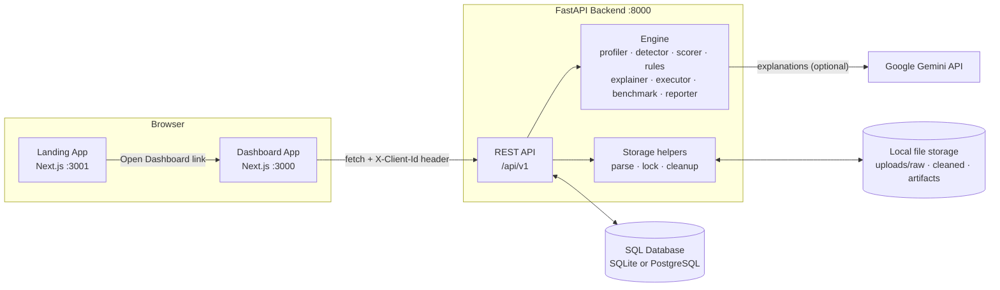

**Design principles**

| Principle | How it is implemented |
|---|---|
| Deterministic decisions | Statistical rules choose every fix; the LLM only *explains* the chosen fix. |
| Human-in-the-loop | Every fix is a toggle; destructive fixes are off by default; nothing runs until “Execute”. |
| Honest evaluation | Scaling / imputation / SMOTE happen *inside* each CV fold; score can go down after cleaning. |
| Reproducibility | The exported Python script embeds the exact transform functions and reproduces the exported CSV. |
| Graceful degradation | Gemini down → statistical explanations; optional ML libs missing → skipped models. |
| Consistency | Changing upstream inputs (objective, approvals, diagnostics) invalidates downstream results. |

---

## 2. Repository Layout

```text
Major project/
├── ARCHITECTURE.md                 ← this document
├── README.md
├── backend/
│   ├── .env / .env.example         ← runtime configuration
│   ├── requirements.txt
│   ├── datareadiness.db            ← default SQLite DB (created on first run)
│   ├── uploads/
│   │   ├── raw/                    ← normalized uploaded datasets ({id}.csv)
│   │   ├── cleaned/                ← model-ready outputs ({id}_cleaned.csv)
│   │   └── artifacts/              ← pipeline scripts ({id}_pipeline.py)
│   └── app/
│       ├── main.py                 ← FastAPI app, CORS, lifespan
│       ├── core/
│       │   ├── config.py           ← pydantic-settings Settings
│       │   ├── database.py         ← engine, session, init_db + auto-migration
│       │   └── storage.py          ← parsing, normalization, locks, cleanup
│       ├── models/dataset.py       ← SQLAlchemy ORM models
│       ├── schemas/dataset.py      ← Pydantic request/response models
│       ├── api/
│       │   ├── deps.py             ← client id, ownership, snapshot, invalidation
│       │   └── v1/
│       │       ├── router.py
│       │       └── endpoints/
│       │           ├── health.py
│       │           ├── datasets.py        ← upload, demo, sample, session, delete
│       │           ├── objectives.py      ← target suggestions, objective
│       │           ├── diagnostics.py     ← profile + detect + score + recommend
│       │           ├── recommendations.py ← list, approve, regenerate explanations
│       │           ├── pipeline.py        ← execute approved fixes
│       │           ├── benchmarks.py      ← model leaderboard
│       │           └── exports.py         ← CSV, script, PDF, manifest
│       └── engine/
│           ├── profiler.py
│           ├── detector.py
│           ├── scorer.py
│           ├── rules.py
│           ├── explainer.py
│           ├── transforms.py
│           ├── executor.py
│           ├── benchmark.py
│           └── reporter.py
└── frontend/                       ← npm workspaces + Turborepo
    ├── package.json                ← "turbo dev" etc.
    └── apps/
        ├── dashboard/              ← the product UI (port 3000)
        │   └── src/
        │       ├── app/{layout,page}.tsx
        │       ├── services/api.ts
        │       └── components/
        │           ├── Header.tsx, Stepper.tsx
        │           ├── UploadStep.tsx, ObjectiveStep.tsx
        │           ├── HealthScoreGauge.tsx, ProfileTable.tsx (diagnostic view)
        │           ├── RecommendationChecklist.tsx
        │           ├── BeforeAfterDiff.tsx, ModelLeaderboard.tsx
        │           └── ExportHub.tsx
        └── landing/                ← marketing site (port 3001)
            └── src/
                ├── app/{layout,page,globals.css}
                ├── lib/motion.ts
                └── components/{Hero,Scanner,Features,Workflow,Exports,primitives}.tsx
```

---

## 3. Technology Stack

| Layer | Technology | Purpose |
|---|---|---|
| API | **FastAPI**, Uvicorn | REST endpoints, OpenAPI docs at `/docs` |
| Validation | **Pydantic v2**, pydantic-settings | Schemas, `.env` configuration |
| ORM / DB | **SQLAlchemy 2**, SQLite (default) / PostgreSQL (`psycopg2-binary`) | Persistence |
| Data | **pandas**, **NumPy**, SciPy | Parsing, profiling, transforms |
| ML | **scikit-learn**, **imbalanced-learn** (SMOTE), optional **XGBoost**, **LightGBM** | Benchmarking |
| Files | openpyxl (`.xlsx`), xlrd (`.xls`) | Excel ingestion |
| Reports | **ReportLab** | PDF audit report |
| AI | Google **Gemini** REST API (`requests`) | Natural-language explanations |
| Frontend | **Next.js 14** (App Router), **React 18**, TypeScript | Dashboard & landing |
| Icons | lucide-react | UI icons |
| Monorepo | npm workspaces + **Turborepo** | Run both apps together |

---

## 4. End-to-End User Flow

The dashboard is a five-step wizard. Each step is backed by one or more API calls.

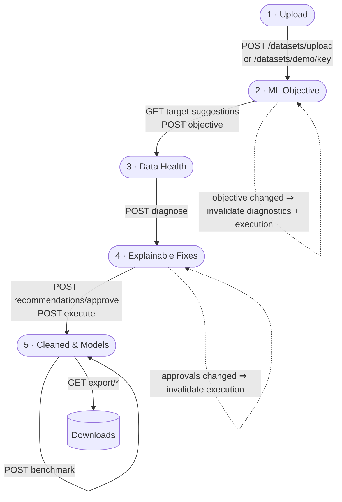

| Step | What the user does | What the system does |
|---|---|---|
| **1. Ingestion** | Drags a CSV/XLSX/XLS file or loads a demo (Titanic, Telco churn, Housing). | Validates size/extension, decodes, sniffs delimiter, normalizes headers, stores `{id}.csv`, returns preview + warnings. |
| **2. ML Objective** | Chooses target column and classification/regression. | Suggests problem type per column, rejects IDs / bad targets, stores objective. |
| **3. Data Health** | Reviews the score, sub-scores, issues and column profiles. | Profiles → detects issues → computes 0–100 score → selects fixes → explains them. |
| **4. Explainable Fixes** | Toggles fixes; clicks *Apply N Fixes* (or *Continue Without Fixes*). | Saves approvals, runs the safe-order executor, re-scores, writes cleaned CSV and script. |
| **5. Results** | Sees before/after diff, leaderboard, downloads artifacts. | Benchmarks models with leak-free CV, builds PDF/manifest on demand. |

Session restore: the dashboard writes `?dataset=<id>` in the URL. Reloading calls `GET /datasets/{id}/session`, which
returns everything (dataset, objective, diagnostics, execution, leaderboard) so the user lands back on the right step.

---

## 5. Backend Architecture

### 5.1 Application Bootstrap

`backend/app/main.py`

1. Inserts the backend root into `sys.path` so `app.*` imports work when started from any directory.
2. Configures logging at `INFO`.
3. **Lifespan** (startup):
   - `init_db()` → `create_all()` + `_add_missing_columns()` (lightweight auto-migration). Errors are **not**
     swallowed, so a misconfigured database fails fast.
   - `cleanup_expired_files()` → deletes stored files older than `FILE_RETENTION_DAYS`.
4. Adds **CORS** for `BACKEND_CORS_ORIGINS`, exposing `Content-Disposition` so the browser can read download names.
5. Mounts the v1 router at `/api/v1`.

All heavy endpoints are **synchronous `def`** functions, so FastAPI runs them in its threadpool and the event loop
stays responsive while pandas/sklearn work.

### 5.2 Configuration

`backend/app/core/config.py` — `Settings(BaseSettings)` reads `backend/.env` (absolute path, so it works from any CWD).

| Setting | Default | Meaning |
|---|---|---|
| `DATABASE_URL` | `sqlite:///backend/datareadiness.db` | Any SQLAlchemy URL (e.g. Neon PostgreSQL). |
| `GEMINI_API_KEY` | `""` | Empty ⇒ statistical explanations only. |
| `GEMINI_MODEL` | `gemini-3.8-flash` | Primary model. |
| `GEMINI_FALLBACK_MODELS` | `["gemini-3.7-flash", "gemini-3.8-flash"]` | Tried in order on overload / unavailability. |
| `GEMINI_TIMEOUT_SEC` | `30` | Per-request timeout. |
| `GEMINI_MAX_RETRIES` | `2` | Retries per model for 429/5xx/timeouts. |
| `GEMINI_TOTAL_BUDGET_SEC` | `45` | Hard cap on total time spent waiting for Gemini. |
| `MAX_UPLOAD_MB` | `200` | Upload limit (413 above it). |
| `MIN_ROWS` | `10` | Minimum rows after cleaning empty rows. |
| `FILE_RETENTION_DAYS` | `7` | Stored files older than this are deleted at startup. |
| `BACKEND_CORS_ORIGINS` | `localhost:3000`, `127.0.0.1:3000` | Allowed browser origins. |
| `UPLOAD_DIR`, `RAW_DATA_DIR`, `CLEANED_DATA_DIR`, `ARTIFACTS_DIR` | under `backend/uploads/` | Created on import. |

Frontend env vars:

| Variable | Default | Used by |
|---|---|---|
| `NEXT_PUBLIC_API_URL` | `http://localhost:8000/api/v1` | Dashboard API client |
| `NEXT_PUBLIC_DASHBOARD_URL` | `http://localhost:3000` | Landing page CTAs |

### 5.3 Database Layer

`backend/app/core/database.py`

- Creates the SQLAlchemy engine from `DATABASE_URL` (`pool_pre_ping`, `pool_recycle=300`; `check_same_thread=False` for SQLite).
- `SessionLocal` with `autoflush=False` (code calls `db.flush()` explicitly where needed, e.g. `get_snapshot`).
- `get_db()` FastAPI dependency yields a session and always closes it.
- `init_db()` creates tables and runs `_add_missing_columns()`, which compares ORM columns with the live table and
  issues `ALTER TABLE … ADD COLUMN` for new nullable columns — so upgrading the code doesn’t require dropping the DB.

### 5.4 Data Model

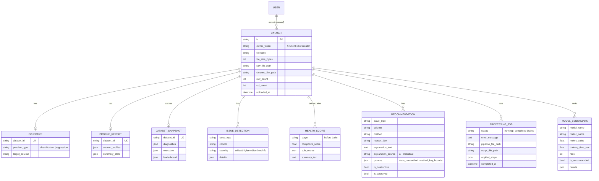

**Why `DatasetSnapshot`?** Diagnostics/execution/leaderboard responses are expensive to rebuild. They are stored as
JSON so `GET /session` can restore the whole UI in one cheap call.

**Why `Recommendation.params`?** It stores the exact statistics the rule used (e.g. IQR bounds, median, category list).
The executor reads these instead of recomputing, so *what the user approved is exactly what runs*.

### 5.5 Ownership, Locking & Invalidation

`backend/app/api/deps.py` and `backend/app/core/storage.py`

**Client identity (no login required)**

- The dashboard generates a random ID once and stores it in `localStorage` (`drp_client_id`).
- Every request sends it as `X-Client-Id`. `get_client_id` validates it (8–64 chars, alphanumeric/dash) → `401` otherwise.
- New datasets store it as `owner_token`.
- `get_owned_dataset` returns **404** if the dataset doesn’t exist **or belongs to another client** (no existence leak),
  and **410** if its raw file has been deleted by retention cleanup.

**Per-dataset lock**

- `dataset_lock(dataset_id)` is an in-process `threading.Lock` per dataset. Diagnose / execute / benchmark /
  regenerate-explanations acquire it non-blockingly; a concurrent request receives **409 Conflict** instead of racing.

**Invalidation helper**

`invalidate_execution(db, dataset)` removes everything derived from an execution:
processing jobs and their files, the cleaned CSV, the “after” health score, model benchmarks, and the
`execution` / `leaderboard` snapshot fields. It is called whenever the inputs to execution change.

### 5.6 File Storage & Ingestion

`backend/app/core/storage.py`

```mermaid
flowchart LR
    U[Uploaded bytes] --> S{size ≤ MAX_UPLOAD_MB?}
    S -- no --> E413[413 Payload Too Large]
    S -- yes --> X{extension}
    X -- .csv --> ENC[try utf-8-sig → utf-8 → cp1252 → latin-1]
    ENC --> SN[csv.Sniffer delimiter , ; \t |]
    X -- .xlsx/.xls --> XL[openpyxl / xlrd<br/>read all sheets → first non-empty]
    SN --> N
    XL --> N[normalize]
    N --> N1[drop fully empty rows/cols]
    N1 --> N2[headers → str, blank/Unnamed → column_N, dedupe _1 _2]
    N2 --> N3[±inf → NaN]
    N3 --> V{≥ 2 columns and ≥ MIN_ROWS rows?}
    V -- no --> E400[400 with explanation]
    V -- yes --> W[write uploads/raw/{id}.csv<br/>+ warnings list]
```

Other helpers:

| Function | Role |
|---|---|
| `sanitize_filename` | Strips path components and unsafe characters (prevents path traversal). |
| `read_dataset(path, nrows)` | Reads the normalized CSV back. |
| `json_safe(obj)` | Converts NaN/inf → `None`, NumPy scalars → Python types (valid JSON everywhere). |
| `remove_files(*paths)` | Best-effort deletion. |
| `cleanup_expired_files()` | Retention cleanup at startup. |

### 5.7 REST API Reference

Base URL: `http://localhost:8000/api/v1`. All `/datasets/*` routes require the `X-Client-Id` header.

| Method | Path | Purpose | Notes / errors |
|---|---|---|---|
| GET | `/health` | Liveness | Used by the dashboard header (Online/Offline). |
| POST | `/datasets/upload` | Upload CSV/XLSX/XLS (multipart `file`) | 400 bad file, 413 too large; returns preview + `warnings`. |
| POST | `/datasets/demo/{key}` | Load `titanic`, `churn` or `housing` | Seeded realistic data with real defects. |
| GET | `/datasets/{id}/sample` | First rows preview | |
| GET | `/datasets/{id}/session` | Full restore payload | dataset, objective, diagnostics, execution, leaderboard. |
| DELETE | `/datasets/{id}` | Delete dataset + all files and rows | 204. |
| GET | `/datasets/{id}/target-suggestions` | Per-column suggested problem type + warnings | |
| POST | `/datasets/{id}/objective` | Set target + problem type | 400 if ID column, mismatch, single-row classes, <10 labels. Changing it clears diagnostics & execution. |
| GET | `/datasets/{id}/objective` | Read objective | |
| POST | `/datasets/{id}/diagnose` | Profile → detect → score → recommend → explain | 400 without objective, 409 if busy. Clears previous execution. |
| GET | `/datasets/{id}/recommendations` | List recommendations | |
| POST | `/datasets/{id}/recommendations/approve` | `{ "approvals": { id: bool } }` | 400 for unknown IDs; a real change invalidates execution. |
| POST | `/datasets/{id}/recommendations/explain` | Retry AI explanations | 400 no key / no diagnostics, 503 if Gemini still unavailable. Never changes approvals. |
| POST | `/datasets/{id}/execute` | Run approved fixes | 400 without diagnostics, 409 if busy; returns before/after scores, signed deltas, steps. |
| POST | `/datasets/{id}/benchmark` | Cross-validated leaderboard | 400 if not executed or target unsuitable. |
| GET | `/datasets/{id}/export/cleaned-csv` | Model-ready CSV | |
| GET | `/datasets/{id}/export/pipeline-script` | Standalone Python script | |
| GET | `/datasets/{id}/export/pdf-report` | PDF audit report | Works even if not executed (“not executed”). |
| GET | `/datasets/{id}/export/manifest-json` | Machine-readable manifest | params, sources, applied steps, scores. |

Interactive docs: `http://localhost:8000/docs`.

---

## 6. The Engine (Core Intelligence)

The engine is pure Python with no web dependencies, which makes it testable in isolation.

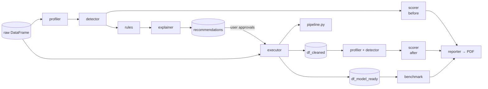

### 6.1 Profiler — `profiler.py`

Builds `summary_stats` (rows, columns, overall missing %, duplicate rows/% …) and one profile per column.

**Semantic type inference** (beyond pandas dtypes):

| Type | Rule |
|---|---|
| `identifier` | All values unique **and** (strong ID token like `uuid`, last name token in `{id, key, code…}`, or a sequential integer column with > 20 rows). Uses `name_tokens()` which splits `snake_case` and `camelCase`. |
| `boolean` | Two values from a case-insensitive boolean vocabulary (`yes/no`, `true/false`, `0/1`, `y/n` …). |
| `year` | Integer values in a plausible year range **and** name contains “year”. |
| `datetime_string` | Text values matching date-like patterns (and/or date-ish name tokens). |
| `numeric` / `categorical` / `text` | Fallbacks by dtype and cardinality. |

Per-column stats include missing count/%, unique count/%, cardinality, mean/median/std/skew/min/max, IQR bounds and
outlier counts for numerics, top values for categoricals, and sample values.

**Duplicates ignore identifier columns** (`duplicate_subset`, `count_duplicate_records`): a passenger re-entered with a
new `PassengerId` is still a duplicate.

### 6.2 Detector — `detector.py`

Produces a list of issues `{issue_type, column, severity, title, details}`:

| Issue type | Trigger |
|---|---|
| `duplicate_rows` | Duplicate records (ID columns excluded). |
| `missing_target` | Rows with no target label. |
| `identifier_column` | Column profiled as an identifier. |
| `missing_values` | Missing values in a feature (target handled separately). |
| `constant_feature` | Single distinct value (any dtype). |
| `unparsed_datetime_feature` | Date strings stored as text. |
| `unit_mixed_feature` | Values like `12 kg`, `3.5 lbs`. |
| `multilabel_delimited_text` | Delimited lists like `a, b; c`. |
| `high_cardinality_text` | > 50 unique, or > 40 % unique when rows > 50. |
| `rare_categories` | More than 10 categories with a long tail. |
| `invalid_domain_values` | Negative values in a column whose name contains a non-negative keyword (`age`, `price`, `fare`, `count` … whole-word match). |
| `statistical_outliers` | Numeric columns with > 1 % values outside 1.5×IQR. |
| `categorical_encoding` | Text features that need encoding (aggregate, info severity). |
| `multicollinear_features` | Pearson \|r\| > 0.85 (top 5 pairs, never drops both sides). |
| `class_imbalance` | Majority/minority ratio ≥ 3 (multi-class aware; stores `imbalance_ratio`). |

### 6.3 Scorer — `scorer.py`

Six sub-scores (each 0–100) combined with weights:

| Sub-score | Weight | Penalty formula |
|---|---|---|
| Missingness | **25 %** | `overall_missing% × 2.5 + worst_column_missing% × 0.25` |
| Duplicates | 15 % | `duplicate% × 5` |
| Outliers | 15 % | `avg_outlier% × 3 + 4 × (#outlier columns)` |
| Validity | 15 % | `20 × (#invalid-domain issues)` |
| Target balance | 15 % | `(imbalance_ratio − 1) × 12` (classification only) |
| Feature quality | 15 % | `10 × collinear pairs + 15 × constant cols + 5 × ID cols` |

\[
\text{composite} = \sum_i w_i \cdot s_i \;-\; \min(20,\; 20 \times \text{dropped\_informative\_ratio})
\]

The **retention penalty** (after-score only) prevents gaming the score by deleting problematic columns.

Grades: **A** ≥ 90 · **B** ≥ 80 · **C** ≥ 70 · **D** ≥ 60 · **F** < 60. The scorer also returns a summary sentence and
the top negative drivers (e.g. “missing values”, “class imbalance”).

### 6.4 Rules Engine — `rules.py`

Maps each issue to a concrete fix. Every recommendation carries `stats_context.method_key` and the exact parameters.

| Issue | Fix (`method_key`) | Default approved? |
|---|---|---|
| duplicate_rows | `drop_duplicates` | ✅ |
| missing_target | `drop_missing_target` | ✅ |
| identifier_column | `drop_identifier` | ✅ |
| missing_values > 70 % | `drop_column_missing` | ❌ (destructive) |
| missing numeric / year | `impute_median` if \|skew\| > 1 else `impute_mean` | ✅ |
| missing categorical / boolean | `impute_mode` | ✅ |
| missing free text / entity | `impute_unknown` (+ `has_<col>` flag) | ✅ |
| unparsed_datetime_feature | `parse_datetime` → year / month / day | ✅ |
| unit_mixed_feature | `split_units` → value + unit | ✅ |
| multilabel_delimited_text | `multi_hot` (exact tokens) | ✅ |
| invalid_domain_values | `replace_negatives_median` | ✅ |
| statistical_outliers | `cap_outliers` at stored IQR bounds | ✅ |
| multicollinear_features | `drop_collinear` | ❌ |
| constant_feature | `drop_constant` | ✅ |
| high_cardinality_text | `drop_high_cardinality` | ✅ |
| rare_categories | `group_rare` (top-10 + `Other`) | ✅ |
| categorical_encoding | `one_hot_encode` (fixed category lists) | ✅ |
| class_imbalance | `smote_class_weights` (ratio ≥ 6) or `class_weights` | ✅ (applied only during benchmarking) |

### 6.5 Explainer — `explainer.py`

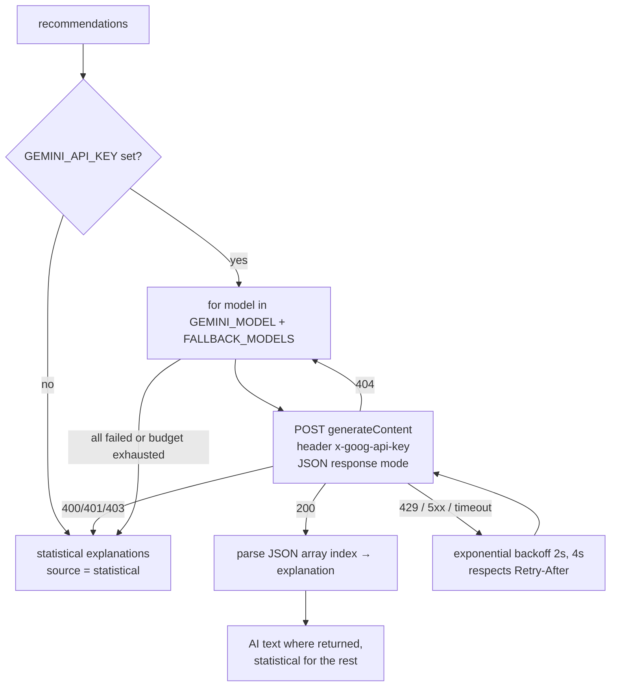

- The prompt sends only the computed statistics and instructs the model to cite them, never invent numbers, and
  never change the chosen method.
- Fallback explanations are deterministic templates keyed by `method_key`, filled with the real statistics.
- Each recommendation records `explanation_source` (`ai` / `statistical`) and the UI labels it.
- Total waiting is capped by `GEMINI_TOTAL_BUDGET_SEC`; the user can retry later via
  `POST /recommendations/explain` (the “Retry AI Explanations” button).
- Only exception *types* are logged so request details (and the key) never reach logs.

### 6.6 Transforms — `transforms.py`

Pure, side-effect-free pandas functions. The executor calls them, **and** their source code is embedded verbatim
into the exported script (`inspect.getsource`) — guaranteeing the script reproduces the app’s output.

| Function | Behaviour |
|---|---|
| `drop_rows_missing(df, col)` | Remove rows with missing target. |
| `drop_duplicate_rows(df, subset)` | Drop duplicates using non-ID columns. |
| `drop_columns(df, cols)` | Remove columns. |
| `extract_datetime(df, col, fill_year, fill_month, fill_day)` | Parse dates → `col_year/month/day`. |
| `split_units(df, col, fill_value)` | `"12 kg"` → `col_value`, `col_unit`. |
| `multi_hot(df, col, tokens)` | One indicator column per known token. |
| `replace_negatives(df, col, value)` | Negative → stored median. |
| `clip_values(df, col, lower, upper)` | Cap at stored IQR bounds. |
| `fill_missing(df, col, value, add_flag)` | Impute (optionally add `has_<col>`). |
| `group_rare(df, col, keep)` | Values outside `keep` → `Other`. |
| `one_hot(df, col, categories)` | Fixed-category one-hot encoding. |

### 6.7 Executor — `executor.py`

Applies only approved recommendations in a **safe order**:

```text
1. drop rows with missing target
2. drop duplicate records
3. drop identifier columns
4. parse datetimes
5. split value+unit columns
6. multi-hot delimited lists
7. replace invalid negatives
8. drop columns (constant / high-cardinality / >70% missing / collinear)
9. cap outliers            ← before imputation so fills aren't skewed
10. impute missing values
11. group rare categories
12. one-hot encode         ← skipped for > 50 categories
```

Returns a `PipelineResult`:

| Field | Meaning |
|---|---|
| `df_cleaned` | Cleaned but **not encoded** — used for re-profiling / after-score (fair comparison). |
| `df_model_ready` | Encoded output — saved as the cleaned CSV and used for benchmarking. |
| `applied_steps` | Human-readable list of what ran. |
| `script_code` | The generated standalone Python script. |
| `dropped_informative_columns` | Feeds the scorer’s retention penalty. |

There is deliberately **no scaling, SMOTE or blanket “fill everything”** in the executor: scaling/SMOTE belong inside
model training folds, and silent fills would hide data problems.

**Generated script structure** (`{id}_pipeline.py`):

```python
# header: dataset, timestamp, how to run
# <verbatim source of transforms.py helpers>
def clean_data(df):
    df = drop_rows_missing(df, "Survived")
    df = drop_duplicate_rows(df, subset=[...])
    ...
    return df

if __name__ == "__main__":
    # python pipeline.py input.csv output.csv
```

### 6.8 Benchmark — `benchmark.py`

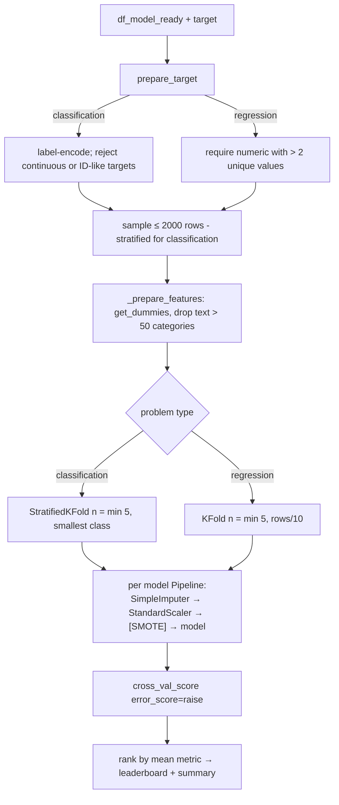

- **Metrics:** classification = **F1-Score (Macro)**, regression = **R² Score**.
- **Models (classification):** Random Forest, XGBoost*, LightGBM*, Gradient Boosting, Logistic Regression,
  Decision Tree, SVM (RBF). **Regression:** Random Forest, XGBoost*, LightGBM*, Ridge Regression, Gradient Boosting,
  Decision Tree, SVR. (*if installed)
- **Imbalance:** if the approved recommendation is `class_weights` → `class_weight="balanced"`; if
  `smote_class_weights` → SMOTE inside the pipeline (fold-safe) with `k_neighbors` adapted to the smallest class.
- **Why it’s honest:** imputation, scaling and SMOTE are fitted on each training fold only — the validation fold never
  leaks into preprocessing. Titanic lands around **0.78 F1** instead of a suspicious 1.000.
- If every model fails → `BenchmarkError` → HTTP 400 with the reason.

### 6.9 Reporter — `reporter.py`

Builds the PDF with ReportLab:

- Title, dataset name (HTML-escaped), generation time.
- Before / after composite scores and grades (“not executed” if there is no after score).
- Table of all six sub-scores with **signed** deltas (`+12.5`, `−3.0`).
- Applied steps (escaped), the leaderboard or a “no benchmarks yet” note.

---

## 7. Frontend Architecture

### 7.1 Monorepo

`frontend/package.json` uses npm workspaces (`apps/*`) and Turborepo:

| Script | Effect |
|---|---|
| `npm run dev` | Starts **dashboard (3000)** and **landing (3001)** together. |
| `npm run dev:dashboard` / `dev:landing` | One app only. |
| `npm run build` / `check-types` / `lint` | Across all apps. |

### 7.2 Dashboard App (port 3000)

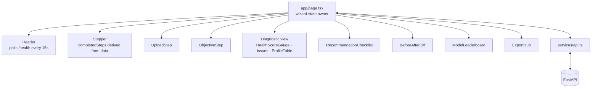

**`services/api.ts`** — the single gateway to the backend:

- `getClientId()` — creates/stores `drp_client_id` in `localStorage`; attached as `X-Client-Id` on every request.
- `request()` / `requestJson()` — wraps `fetch`; network failure → “Cannot reach the backend at …”.
- `extractErrorMessage()` — handles FastAPI `detail` strings, 422 validation arrays and non-JSON bodies → `ApiError(message, status)`.
- Methods: `checkHealth`, `uploadDataset`, `loadDemo`, `getSession`, `deleteDataset`, `getTargetSuggestions`,
  `setObjective`, `runDiagnostics`, `updateApprovals`, `regenerateExplanations`, `executePipeline`, `runBenchmarks`,
  `downloadExport(id, kind, fallbackName)` (fetches a blob and triggers a download using `Content-Disposition`).
- Constants: `MAX_UPLOAD_MB`, `SUPPORTED_EXTENSIONS` (client-side pre-validation).

**`app/page.tsx`** — owns all wizard state:

| State | Purpose |
|---|---|
| `dataset`, `objective`, `diagnostics`, `executionResult`, `leaderboard` | Server data per step. |
| `approvals` | Current toggle state (source of truth for the checklist). |
| `executedApprovals` | Approvals at last execution → shows a “changed since last run” banner. |
| `currentStep` | Visible step; `completedSteps` is **derived** from which data exists. |
| `error`, `notices`, `benchmarkError`, loading flags | Dismissible banners, separate benchmark retry. |

Key behaviours:

- **Restore:** on load, `?dataset=<id>` → `getSession` → rebuilds state and jumps to the furthest valid step.
- **Objective unchanged** → skips re-calling the API (no needless invalidation).
- **Execute:** `updateApprovals` → `executePipeline` → navigate to results → `runBenchmarks` in the background.
  A benchmark failure shows its own retry button and doesn’t hide the cleaning results.
- **Reset:** confirmation, then `DELETE /datasets/{id}`.

**Components**

| Component | Responsibility |
|---|---|
| `Header` | Brand + live backend status (Online / Offline / Checking). |
| `HealthScoreGauge` | Composite score dial, grade and sub-score breakdown. |
| `ProfileTable` | Per-column profile (type, missing %, unique, stats). |
| `Stepper` | Five steps; completed ones are clickable. |
| `UploadStep` | Drag & drop, extension/size checks, ignores input while loading, resets input to allow same file, three demo cards. |
| `ObjectiveStep` | Target dropdown with suggestions, auto-sets problem type, warnings, “(not recommended)” options. |
| `RecommendationChecklist` | Toggles, Approve/Reject all, AI vs Statistical badge, **Retry AI Explanations**, execution progress modal, “Continue Without Fixes”. |
| `BeforeAfterDiff` | Before/after scores, signed delta coloured by sign, honest message, applied steps. |
| `ModelLeaderboard` | Ranked models, metric, CV folds, summary, empty state. |
| `ExportHub` | Four download buttons with busy/error states, enabled based on what exists. |

### 7.3 Landing App (port 3001)

A marketing page built with plain React + CSS (no animation library), honouring `prefers-reduced-motion`.

| Section | Component | Effects |
|---|---|---|
| Nav | `Hero.tsx › Nav` | Sticky blurred bar, underline-sweep links, magnetic CTA. |
| Hero | `Hero.tsx` | Sky with 3 parallax cloud layers (SVG turbulence filter), scrambling headline, self-drawing squiggle, handwritten note. |
| Tech strip | `Hero.tsx` | Boxed stack labels that flip to their role on hover. |
| Live scan | `Scanner.tsx` | Sticky scroll-driven scanner fixes a dirty Titanic table; score 54 → 94; fix log ticks. |
| Features | `Features.tsx` | Bento grid, 3D tilt + cursor spotlight, animated score bars, working toggles. |
| Workflow | `Workflow.tsx` | Pinned horizontal scroll through 5 steps with progress bar. |
| Exports | `Exports.tsx` | Typing terminal with `pipeline.py` / `manifest.json` / leaderboard tabs. |
| CTA + footer | `Exports.tsx` | Drifting colour blobs; giant outlined wordmark that fills under the cursor. |

Shared utilities live in `lib/motion.ts` (`useInView`, `useStickyProgress`, `useReducedMotion`, `trackPointer`) and
`components/primitives.tsx` (`Reveal`, `Eyebrow`, `MagneticLink`, `Scramble`, `Squiggle`, `HandArrow`).

---

## 8. Request Lifecycles

### 8.1 Upload

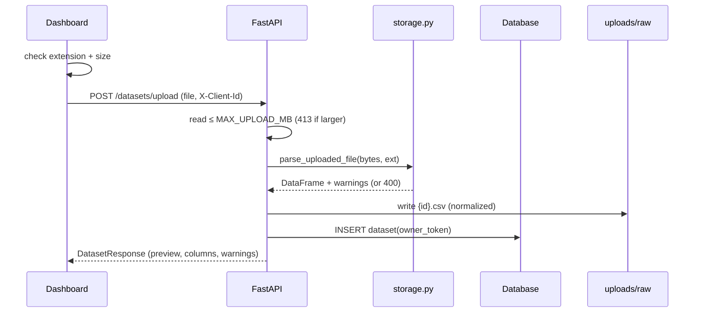

### 8.2 Diagnose

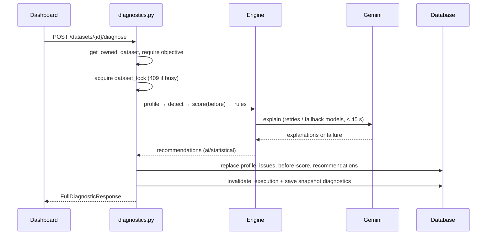

### 8.3 Execute + Benchmark

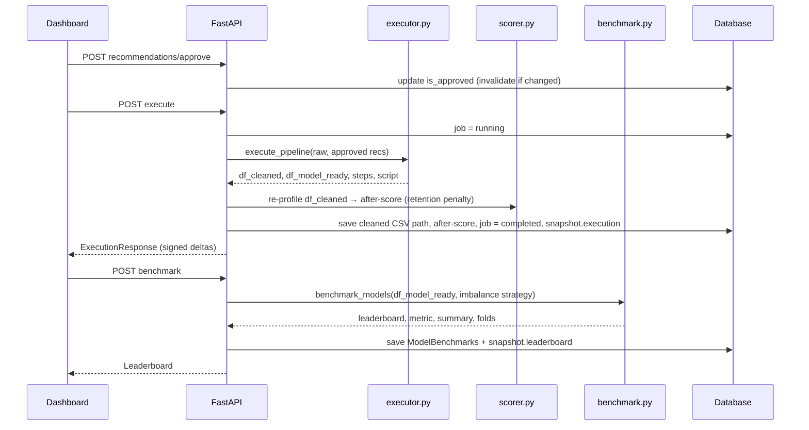

---

## 9. State Machine & Invalidation Rules

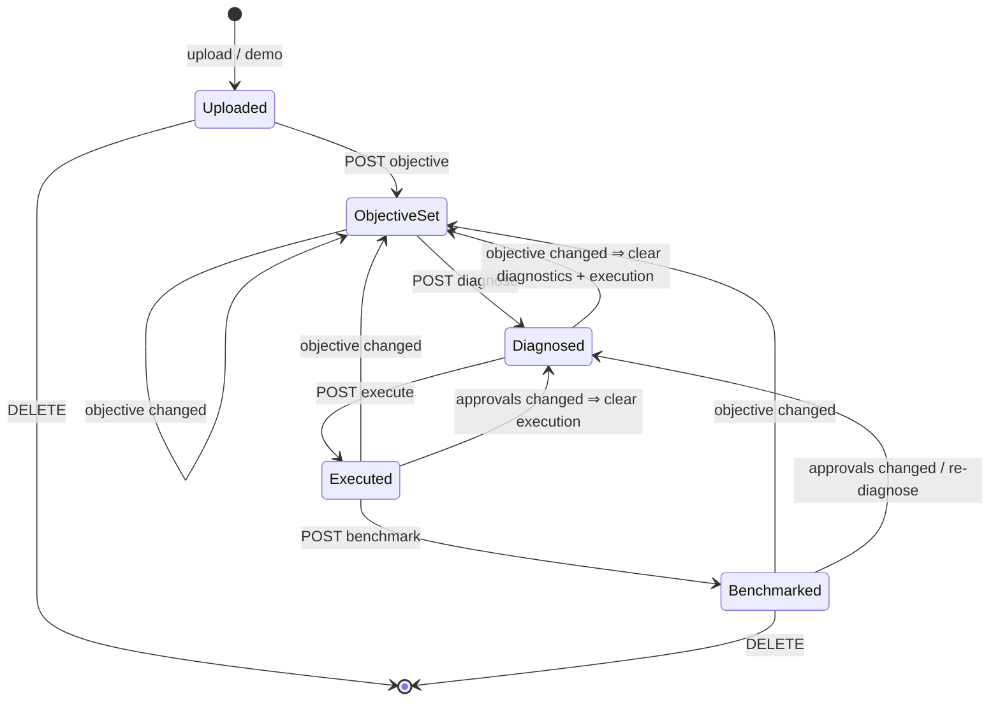

| Trigger | What is cleared |
|---|---|
| Objective changed | Profile, issues, before/after scores, recommendations, jobs, cleaned file, benchmarks, snapshot. |
| Diagnose re-run | Previous recommendations + all execution results. |
| Approval actually changed | Execution results (jobs, cleaned CSV, after-score, benchmarks, snapshot.execution/leaderboard). |
| Regenerate explanations | Nothing — only `explanation_text` / `explanation_source` change. |
| Delete | Everything for the dataset, including files. |

Preconditions enforced server-side: objective before diagnose, diagnostics before execute, execution before benchmark.

---

## 10. Error Handling Strategy

| Situation | Backend response | Frontend behaviour |
|---|---|---|
| Missing/invalid `X-Client-Id` | 401 | The ID is created automatically in `localStorage`, so this only happens if it is tampered with. |
| Dataset not found / not yours | 404 | During session restore: clears `?dataset=` and asks the user to upload again. |
| Raw file expired | 410 | Same as 404: “session is no longer available, please upload again”. |
| Bad file / too few rows / invalid target | 400 with explanation | Dismissible error banner with the server’s message. |
| File too large | 413 | Caught client-side first. |
| Concurrent operation | 409 | Error banner with the server’s “operation already running” message. |
| Gemini down | 200 with statistical explanations; 503 only on explicit retry | Badge shows “Statistical”; retry button. |
| Benchmark impossible | 400 (`BenchmarkError`) | Separate benchmark error with retry. |
| Backend offline | network error | Header shows Offline; “Cannot reach the backend”. |

---

## 11. Security Model

- **No secrets in code** — DB URL and Gemini key come from `backend/.env` (git-ignored); `.env.example` has placeholders.
  > ⚠️ An old Neon database password exists in git history and must be rotated.
- **Per-browser isolation** via `X-Client-Id` + `owner_token`; foreign datasets return 404.
- **Path traversal protection** — uploaded names are sanitized and files are always saved as `{uuid}.csv`.
- **Upload limits** — size cap streamed server-side, extension allow-list.
- **Output escaping** — dataset names and steps are escaped in the PDF.
- **Gemini key** sent in the `x-goog-api-key` header (not the URL) and never logged.
- **Retention** — stored files are purged after `FILE_RETENTION_DAYS`.
- **CORS** limited to configured origins.

> The client ID is an isolation mechanism, not authentication. For multi-user production use, add real auth
> (the `User` table and `Dataset.user_id` are already reserved for this).

---

## 12. Running the Project

### Backend

```bash
cd backend
python -m venv .venv
.venv\Scripts\activate            # Windows  (source .venv/bin/activate on macOS/Linux)
pip install -r requirements.txt
copy .env.example .env            # then fill GEMINI_API_KEY / DATABASE_URL if wanted
uvicorn app.main:app --reload --port 8000
```

- API: `http://localhost:8000` · Docs: `http://localhost:8000/docs`
- Without `DATABASE_URL`, a local SQLite file `backend/datareadiness.db` is used.
- For PostgreSQL, `psycopg2-binary` (in requirements) must be installed.

### Frontend

```bash
cd frontend
npm install
npm run dev            # dashboard → http://localhost:3000, landing → http://localhost:3001
```

> Don’t run `next build` inside an app while its `next dev` server is running — both use the same `.next` folder,
> and the dev server will start returning 404s for CSS/JS. Stop dev, build, then restart.

---

## 13. Testing & Verification

The fixes were validated with an end-to-end script driving the API through FastAPI’s `TestClient` against a temporary
SQLite database (Gemini disabled), covering:

- Uploads: single-column file, unsupported extension, semicolon + cp1252 CSV, path-traversal filename, Excel with
  numeric headers, infinities.
- Flow guards: execute before diagnose rejected, foreign recommendation IDs rejected, ownership checks for read/delete.
- Correctness: signed score deltas, ID-aware duplicates, numeric median/mean imputation, mode imputation for
  low-cardinality ints, target labels preserved.
- **Reproducibility:** the exported `pipeline.py` run on the raw file produces exactly the exported CSV.
- **Honest benchmarks:** no suspicious perfect scores (Titanic ≈ 0.78 F1, Housing R² ≈ 0.84).
- Edge cases: clean dataset → no recommendations; reject-all → execute & benchmark still work; PDF after reject-all.
- Session restore and deletion.

Frontend: `tsc --noEmit` and `next build` pass for both apps; the landing page was checked with Playwright
screenshots on desktop and mobile (no console errors, no horizontal overflow).

---

## 14. Known Limitations & Future Work

| Limitation | Possible improvement |
|---|---|
| Diagnose / execute / benchmark are synchronous requests (threadpool, not background jobs). | Task queue (Celery/RQ/Arq) + polling or WebSockets with progress. |
| Locks are in-process; multiple Uvicorn workers wouldn’t share them. | DB row locks or Redis locks. |
| Client-ID isolation, no accounts. | Real authentication using the reserved `User` table. |
| Benchmark samples ≤ 2000 rows and uses default hyperparameters. | Configurable sample size, light tuning, holdout test set. |
| Local disk storage. | S3/GCS object storage with signed URLs. |
| Gemini availability depends on Google capacity. | Cache explanations per stats signature; background regeneration. |
| Schema changes rely on additive auto-migration. | Alembic migrations for renames/drops. |
