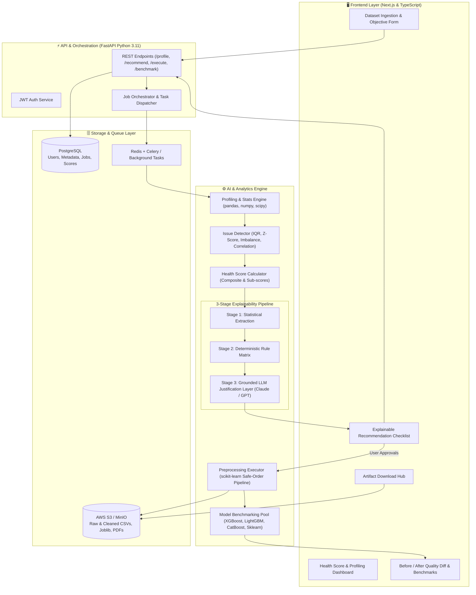
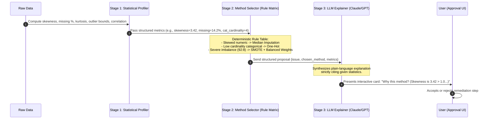
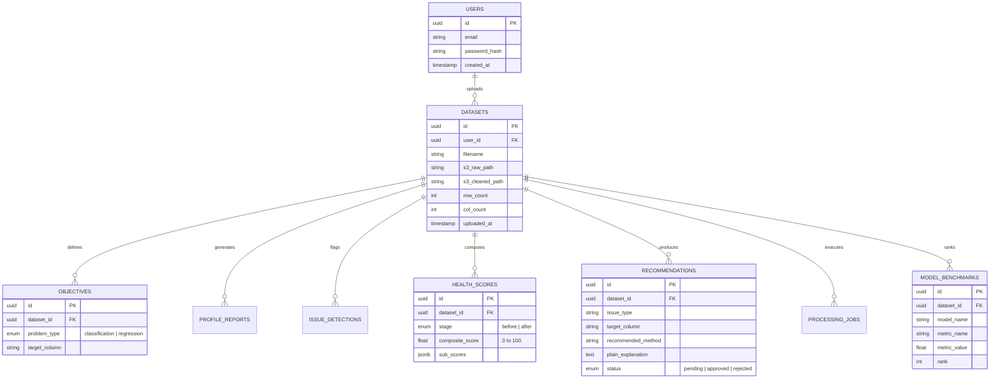

# 🛡️ AI Data Readiness Platform (AegisMind)

> **An Explainable Pre-ML Data Diagnosis, Cleaning & Model Recommendation System**  
> *Closing the critical gap between messy raw data and robust machine learning pipelines.*

---

## 📌 Executive Summary

Most modern AutoML frameworks answer the question: **"Which model should I train?"**  
**AI Data Readiness Platform** answers the fundamental question that must come first:  
👉 **"Is my data ready for machine learning, and what exact steps are required to make it ready?"**

Raw tabular data is plagued by missing values, duplicates, statistical outliers, encoding errors, class imbalance, and multicollinear features. Beginners and intermediate practitioners frequently train models directly on substandard data, leading to garbage-in/garbage-out results, overfitting, or silent model failures.

This platform operates as an **intelligent, explainable diagnostic and remediation gateway**. It profiles raw datasets, computes a transparent **0–100 Data Health Score**, provides **AI-powered plain-language justifications** for recommended fixes, executes only **user-approved transformations**, quantifies before-vs-after improvements, and benchmarks the best candidate ML models.

---

## 🎯 Core Differentiators

- **100% Explainable & Grounded:** Every remediation recommendation is grounded in deterministic statistics with natural-language reasoning (no black-box hallucinations).
- **Human-in-the-Loop Control:** Zero destructive data edits without explicit user approval. Users toggle individual recommendations via an interactive checklist.
- **Reproducible Artifacts:** Exports production-ready scikit-learn preprocessing pipelines (`.joblib`/Python scripts), cleaned CSVs, and executive PDF audit reports.
- **Safe-Order Transformation Engine:** Applies data cleaning steps in a mathematically sound sequence (deduplication $\rightarrow$ imputation $\rightarrow$ encoding $\rightarrow$ outlier handling $\rightarrow$ scaling $\rightarrow$ resampling $\rightarrow$ feature selection).

---

## 🚀 Feature Matrix: v1 (MVP) vs. v2 (Roadmap)

| Feature Area | 🌟 Version 1.0 (Current Scope) | 🔮 Version 2.0+ (Future Roadmap) |
| :--- | :--- | :--- |
| **Data Ingestion** | • Tabular CSV and Excel (`.xlsx`) up to 200 MB<br>• Automated dtype inference (numeric, categorical, datetime, text, boolean, ID-like)<br>• Secure persistence via AWS S3 / MinIO & PostgreSQL | • Unstructured data (images, audio, free text corpora)<br>• Cloud database connectors (Snowflake, BigQuery, PostgreSQL)<br>• Streaming / real-time ingestion (Kafka / Webhooks) |
| **ML Problem Types** | • Supervised Tabular Learning: Binary Classification, Multi-class Classification, Regression | • Time-series forecasting (seasonality, stationarity, temporal leakage checks)<br>• Unsupervised clustering & anomaly detection |
| **Data Profiling & Quality Audit** | • Missingness per column and dataset-wide<br>• Cardinality & unique count analysis<br>• Distribution metrics (skewness, kurtosis, IQR, variance)<br>• Exact duplicate row detection | • Fuzzy duplicate detection & entity resolution<br>• Semantic drift & distribution shift detection<br>• PII (Personally Identifiable Information) redaction |
| **Issue Detection Suite** | • Statistical outliers (IQR bounds & Z-score)<br>• Domain validity heuristics (e.g., negative age/salary)<br>• Class imbalance ratio detection (configurable thresholds)<br>• High-correlation / multicollinearity & redundant feature flags | • Advanced label noise detection (Confident Learning)<br>• Automated feature interaction / leakage detection |
| **Data Health Score** | • 0–100 composite Health Score<br>• Weighted sub-scores: Missingness, Duplication, Outliers, Validity, Balance, Feature Quality<br>• Top issue drivers summary | • Industry/domain-specific scoring weights (Healthcare, Finance, eCommerce)<br>• Historical score tracking across dataset versions |
| **Recommendation Engine** | • 3-Stage Hybrid Decision Pipeline (Deterministic Stats $\rightarrow$ Rule-based selection $\rightarrow$ LLM explanation)<br>• Safe default pre-checks (destructive fixes unchecked)<br>• Template fallback if LLM API is unavailable | • Meta-learned method selection (meta-model trained on OpenML dataset characteristics)<br>• Multi-strategy simulation & comparison |
| **Preprocessing & Transformation** | • Fixed safe-order execution pipeline<br>• Configurable strategies (Mean/Median/KNN imputation, One-Hot/Target encoding, Robust/Standard scaling, SMOTE/Class-weights)<br>• Full reproducibility | • Automated custom feature engineering generation<br>• GPU-accelerated cuML / Polars pipeline execution |
| **Before / After Evaluation** | • Side-by-side diagnostic metric comparison<br>• Health Score delta ($\Delta$) computation<br>• Executive plain-language summary of improvements | • Data distribution overlay charts (KDE / histograms)<br>• Feature drift & data leakage validation |
| **Model Recommendation** | • Fast multi-model benchmarking (Scikit-learn, XGBoost, LightGBM, CatBoost)<br>• Ranked leaderboard (F1, ROC-AUC, RMSE, R²)<br>• Expected performance tier estimation | • One-click automated hyperparameter tuning (Optuna)<br>• Model export to ONNX / TorchScript / BentoML<br>• One-click cloud deployment endpoint |
| **Export & Reporting** | • Cleaned dataset download (CSV)<br>• Serialized preprocessing pipeline (`.joblib` / Python code)<br>• Executive Data Quality Audit Report (PDF via ReportLab/WeasyPrint)<br>• Model recommendation manifest (JSON) | • Team workspace sharing & role-based access control (RBAC)<br>• Direct push to HuggingFace Datasets / DVC / MLflow |

---

## 🏗️ System Architecture



---

## 🧠 The 3-Stage Explainable AI Decision Engine

To guarantee academic rigor, deterministic repeatability, and zero hallucination, the decision pipeline separates statistical logic from natural language generation:



---

## 📊 High-Level Data Model (PostgreSQL)



---

## 🛠️ Technology Stack

| Layer | Technologies | Purpose |
| :--- | :--- | :--- |
| **Frontend** | Next.js 14+ (React, TypeScript), Vanilla CSS / Tailored CSS, Lucide Icons | Server-side rendering, responsive dashboard, real-time job feedback |
| **Backend API** | FastAPI (Python 3.11), Pydantic v2, Uvicorn | High-performance asynchronous API, auto OpenAPI documentation |
| **Data Engine & ML** | pandas, numpy, scipy, scikit-learn, statsmodels | Core statistical profiling, outlier detection, data pipelines |
| **Benchmarking Suite** | scikit-learn, XGBoost, LightGBM, CatBoost | Fast multi-algorithm cross-validation on clean datasets |
| **Explainability (LLM)** | Anthropic Claude API / OpenAI GPT-4o / Template Fallback | Grounded natural language justification for recommended fixes |
| **Database & ORM** | PostgreSQL, SQLAlchemy 2.0, Alembic | Relational data persistence, schema migrations |
| **Object Storage** | AWS S3 / MinIO | Scalable raw & clean file storage, serialized pipelines, reports |
| **Async Processing** | Redis, Celery / FastAPI BackgroundTasks | Offloading heavy profiling and model fitting from HTTP threads |
| **PDF Reporting** | ReportLab / WeasyPrint | Compiling downloadable executive Data Quality Reports |
| **DevOps & Container** | Docker, Docker Compose | Multi-container orchestration (web, api, db, redis, worker) |

---

## 📂 Project Repository Structure

```
Aegis_mind/
├── backend/
│   ├── app/
│   │   ├── api/                  # API routers (auth, datasets, profiling, pipeline, models)
│   │   │   ├── v1/
│   │   │   │   ├── auth.py
│   │   │   │   ├── datasets.py
│   │   │   │   ├── profiling.py
│   │   │   │   ├── recommendations.py
│   │   │   │   ├── pipeline.py
│   │   │   │   └── models.py
│   │   │   └── router.py
│   │   ├── core/                 # Config, security, database session
│   │   │   ├── config.py
│   │   │   ├── database.py
│   │   │   └── security.py
│   │   ├── engine/               # Core analytical and ML intelligence
│   │   │   ├── profiler.py       # Column & dataset profiling logic
│   │   │   ├── detector.py       # Outlier, missingness, imbalance detectors
│   │   │   ├── scorer.py         # Composite & sub-score calculation
│   │   │   ├── rules.py          # Decision rule matrix (Stage 2)
│   │   │   ├── explainer.py      # Grounded LLM prompt synthesis (Stage 3)
│   │   │   ├── executor.py       # Safe-order scikit-learn pipeline builder
│   │   │   └── benchmark.py      # Quick candidate model benchmark runner
│   │   ├── models/               # SQLAlchemy ORM models
│   │   ├── schemas/              # Pydantic schemas (request/response)
│   │   ├── services/             # S3 storage, PDF report generator
│   │   └── main.py               # FastAPI entry point
│   ├── tests/                    # Unit and integration test suite
│   ├── Dockerfile
│   └── requirements.txt
├── frontend/
│   ├── src/
│   │   ├── app/                  # Next.js App Router pages
│   │   │   ├── dashboard/        # Main workspace & projects
│   │   │   ├── dataset/[id]/     # Dataset profiling & health score view
│   │   │   ├── recommendations/  # Interactive approval checklist
│   │   │   ├── compare/          # Before vs. After quality diff
│   │   │   ├── benchmark/        # ML model recommendations
│   │   │   └── login/            # Auth pages
│   │   ├── components/           # Reusable UI components (Score gauges, tables, cards)
│   │   ├── hooks/                # Custom React hooks
│   │   ├── services/             # API client services (Axios / Fetch)
│   │   └── styles/               # CSS Design System
│   ├── Dockerfile
│   └── package.json
├── docker-compose.yml            # Multi-service setup (frontend, backend, postgres, redis)
└── README.md                     # Project documentation
```

---

## ⚡ Quick Start & Local Development

### Prerequisites
- **Node.js** (v18.x or v20.x)
- **Python** (v3.11+)
- **Docker & Docker Compose** (optional, recommended for full stack)
- **PostgreSQL** & **Redis** (if running without Docker)

---

### Option 1: Quickstart with Docker Compose (Recommended)

1. **Clone the repository:**
   ```bash
   git clone https://github.com/NishantDakua/Aegis_mind.git
   cd Major\ project
   ```

2. **Configure environment variables:**
   Create a `.env` file in the root directory:
   ```env
   # Backend Settings
   PROJECT_NAME="AI Data Readiness Platform"
   DATABASE_URL=postgresql://postgres:postgres@db:5432/datareadiness_db
   SECRET_KEY=your_super_secret_jwt_key
   REDIS_URL=redis://redis:6379/0

   # Object Storage (AWS S3 or Local MinIO)
   S3_BUCKET_NAME=data-readiness-artifacts
   AWS_ACCESS_KEY_ID=your_aws_key
   AWS_SECRET_ACCESS_KEY=your_aws_secret
   AWS_REGION=us-east-1

   # LLM API (Anthropic or OpenAI)
   LLM_PROVIDER=anthropic
   ANTHROPIC_API_KEY=sk-ant-api03-...
   # OPENAI_API_KEY=sk-...
   ```

3. **Build and start all services:**
   ```bash
   docker-compose up --build
   ```

4. **Access the application:**
   - Frontend: `http://localhost:3000`
   - FastAPI Docs: `http://localhost:8000/docs`

---

### Option 2: Manual Local Setup

#### 1. Backend Setup
```bash
cd backend
python -m venv venv

# Windows
.\venv\Scripts\activate
# macOS/Linux
source venv/bin/activate

pip install -r requirements.txt
uvicorn app.main:app --reload --port 8000
```

#### 2. Frontend Setup
```bash
cd frontend
npm install
npm run dev
```
Open [http://localhost:3000](http://localhost:3000) to view the web app.

---

## 📈 Success & Evaluation Metrics

- **Diagnostic Speed:** Sub-30-second profiling and issue detection on 100K-row tabular datasets.
- **Explainability Grounding:** Zero ungrounded statistical citations generated by the LLM layer.
- **Downstream Correlation:** Demonstrated positive correlation between Health Score improvement and downstream classification/regression test scores across benchmark datasets (*Titanic, House Prices, Adult Income, Churn*).
- **Viva/Demo Ready:** Complete end-to-end user journey executable live within 5 to 7 minutes.

---

## 👥 Contributors & Acknowledgements

- **Author:** Arif Choudhary
- **Project Type:** Final-Year AIML Capstone Project
- **Corpus / Repository:** `NishantDakua/Aegis_mind`
- **Supervisor / Evaluation:** AIML Capstone Review Committee

---

## 📄 License

This project is licensed under the [MIT License](LICENSE) — free for educational, research, and commercial exploration.
